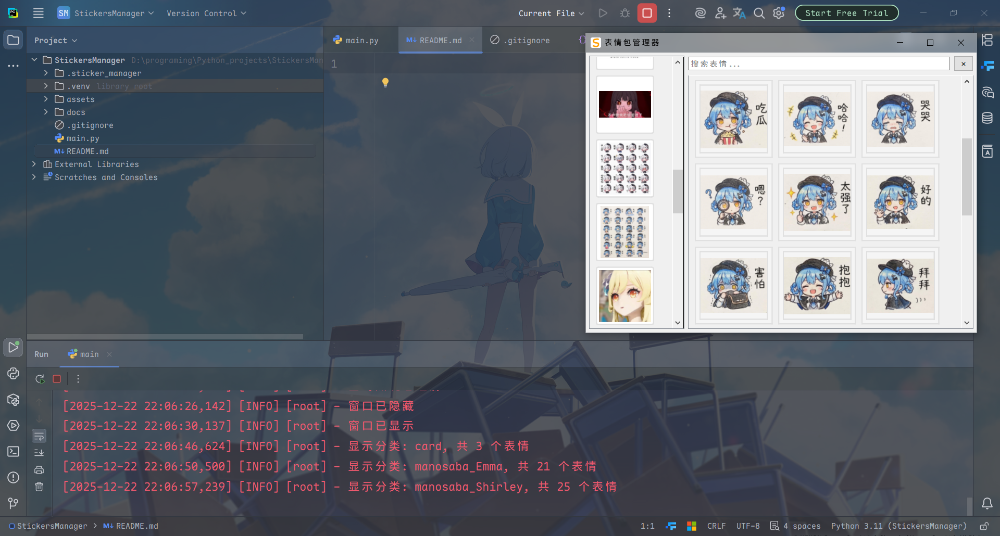

# 介绍

参考[EweSticker](https://github.com/FredHappyface/Android.EweSticker)，在Windows上实现表情包管理

# 预览



# 构建

>[!NOTE]
>
>以下仅为Windows环境下的构建方法

克隆项目到本地

配置环境：

```shell
python -m venv .venv
pip install -r requirements.txt
```

运行：

```shell
call .venv\Scripts\activate
python main.py
```

构建：

```shell
pyinstaller -w -i assets/st.png main.py
```

# 许可证

LICENSE: [CC BY-NC 4.0](https://creativecommons.org/licenses/by-nc/4.0/)
